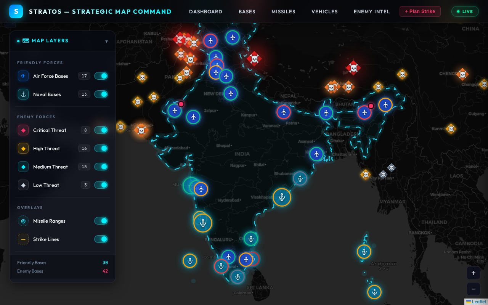

# STRATOS — Strategic Map & Database Command System




A full-stack military command-and-control simulation: an interactive strategic map, live asset/mission management, and a from-scratch relational database engineered to demonstrate real transaction concurrency (deadlocks, dirty reads, lost updates) and advanced SQL — not just a CRUD app.

---

## Why this project

Most database course projects stop at a schema and a few `SELECT` statements. STRATOS goes further: it's built around **15 production-grade SQL queries** mapped explicitly to relational algebra, and a **dedicated multi-threaded transaction engine** that reproduces and resolves classic concurrency failure modes (dirty reads, lost updates, deadlocks) using `SERIALIZABLE` isolation — the kind of problem you'd actually hit running a real backend against a shared database.

## Key Features

| Feature | Description |
|---|---|
| 🗺️ **Interactive Map Dashboard** | Live Leaflet-based map visualizing friendly bases, enemy threats, and military assets by geography, with distance calculations via the Haversine formula. |
| 📦 **Asset Management** | Full tracking of missiles, vehicles, personnel, and resource inventories (fuel, ammunition) across bases. |
| 🎯 **Mission Planning** | Attack simulation engine that cross-references missile range, base readiness, and personnel availability before a strike. |
| 🔄 **Transaction Engine** | 7 multi-threaded transaction demos exposed as live JSON API endpoints — commit, rollback, dirty reads, deadlocks, lost updates, and their resolutions via `SERIALIZABLE` isolation. |
| 📊 **Advanced SQL Suite** | 15 complex queries (joins, aggregation, subqueries, window-style ranking) each documented with the relational algebra operations they implement. |

## Tech Stack

- **Backend:** Python, Flask (modular blueprint architecture)
- **Database:** MySQL — 13+ table relational schema with FK constraints
- **Frontend:** Vanilla JS, Leaflet.js, GeoJSON
- **Concurrency:** Python `threading` for live transaction-conflict demonstrations

## Architecture

```
STRATOS/
├── app.py                  # Flask entry point — registers all blueprints
├── db.py                   # DB connection layer (env-var configured)
├── utils.py                # Haversine distance calculation
├── routes/                 # Modular blueprints, one per domain
│   ├── dashboard.py        # Summary stats
│   ├── bases.py            # Friendly base CRUD + readiness
│   ├── enemy.py            # Enemy base intel
│   ├── missiles.py         # Missile inventory per base
│   ├── vehicles.py         # Vehicle inventory per base
│   ├── missions.py         # Attack simulation / mission analysis
│   ├── operations.py       # Personnel + resource CRUD
│   ├── transactions.py     # 7 transaction-concurrency demo endpoints
│   └── pages.py             # HTML page routing
├── templates/ & static/    # Frontend views, CSS, JS, GeoJSON
├── initialize.sql & seed.sql   # Schema + realistic seed data
├── app_queries_15.sql          # 15 advanced SQL queries
├── queries_explanation.md      # Relational algebra breakdown per query
└── transaction_demo.py         # Standalone CLI transaction demo
```

## Database Schema

13+ interrelated tables modeling a real military domain:

- **`Bases`** / **`Enemy_Base`** — geolocated friendly and hostile installations
- **`Personnel`** — staff tracking with availability status
- **`Vehicle_Type`**, **`Vehicle_Status`**, **`Vehicle_Inventory`** — land/air/sea asset tracking
- **`Missile_Type`**, **`Missile_Inventory`** — arsenal management per base
- **`Resource`**, **`Resource_Inventory`** — fuel/ammo logistics
- **`Attack_Simulation`**, **`Readiness_Report`**, **`Logistics_Transfer`** — operational planning tables

## Getting Started

### Prerequisites
- Python 3.8+
- MySQL Server

### Installation

```bash
git clone https://github.com/Sanchit503/STRATOS.git
cd STRATOS
pip install -r requirements.txt
```

### Database Setup

```bash
mysql -u <your_user> -p < initialize.sql
mysql -u <your_user> -p STRATOS_DB < seed.sql
```

Configure your connection (defaults to `localhost` / `root` if unset):

```bash
export DB_HOST='localhost'
export DB_USER='root'
export DB_PASSWORD='your_password'
export DB_NAME='STRATOS_DB'
```

### Run

```bash
python app.py
```

Visit `http://localhost:5000`.

### Explore the Database Layer

```bash
python run_demo.py           # Runs all 15 advanced SQL queries with formatted output
python transaction_demo.py   # Interactive multi-threaded transaction concurrency demo
```

## Highlights for Reviewers

- **`routes/transactions.py`** — the concurrency engine; each endpoint returns `{before, steps, after, effect}` so the UI can render live before/after DB state.
- **`queries_explanation.md`** — every one of the 15 queries mapped to formal relational algebra ($\sigma$, $\pi$, $\bowtie$, $\gamma$).
- **`utils.py`** — Haversine great-circle distance used for real geographic range calculations in mission planning.

---

*Built as a database systems project demonstrating transaction isolation, concurrency control, and applied relational algebra on top of a full-stack Flask application.*
